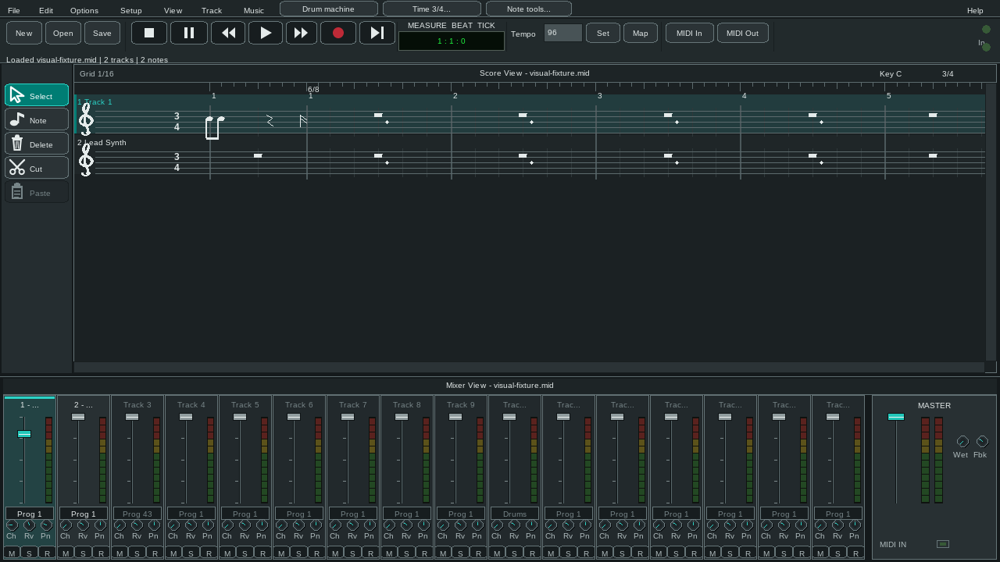

<!--
    Project: OpenSesh
    File: README.md
    Purpose: Introduce the project and direct users to builds and documentation.
    Responsibilities: explain capabilities, prerequisites and release status.
    This file does not contain historical audit results or private reference code.
-->

# OpenSesh

OpenSesh is an independent, GPL-licensed MIDI editor written in FreeBASIC.
It combines a score preview, a sixteen-channel mixer, MIDI and audio editing,
software synthesis, and native MIDI endpoints in one desktop application.



- Load and save Standard MIDI Files, edit notes and tracks, and undo MIDI and
  audio edits in chronological order.
- Play through the built-in synth, a user-supplied SoundFont, or a native MIDI
  endpoint. Export PCM WAV and ProTracker MOD files.
- Create drum phrases, use the performance keyboard, and work with Desktop or
  Touch controls in Light, Dark, or Black themes.

The current version is **0.9.0-dev**. Native package CI targets Windows, Linux,
FreeBSD, NetBSD, OpenBSD and Haiku x86_64. [GitHub releases](https://github.com/fbxl-sj0/OpenMidiSesh/releases)
provide archives with the executable, licenses, corresponding source and checksums.
Extract the complete archive for your system, then run `opensesh.exe` on Windows
or `opensesh` elsewhere. See [platform requirements](docs/CI.md) before downloading.
BSD and Haiku currently support editing and software synthesis without external
MIDI endpoints. Android has a separate packaging path; external Android MIDI
endpoints are unavailable. Development builds have not completed every
physical-device, accessibility, or signing check listed in the release checklist.

## Build and run

The project uses the FreeBASIC 1.20.x toolchain with sfxlib. The exact reviewed
Windows files are recorded in `windows_toolchain_lock.json`; a generic
FreeBASIC installation may lack the required interfaces or libraries.
The redistributable omaGUI source is included in the repository.

Windows PowerShell:

```powershell
powershell -NoProfile -File .\build_editor.ps1 -OutputPath .\build\opensesh.exe
.\build\opensesh.exe
```

Linux with the required compiler and ALSA development libraries installed:

```bash
OUTPUT_PATH="$PWD/build/opensesh" bash build_editor.sh
./build/opensesh
```

Pass a MIDI filename as the first command-line argument to open it at startup.
SoundFonts and personal recordings are not included in release packages.

## Documentation

- [User guide](docs/USER_GUIDE.md): editing, playback, recording, themes, and commands.
- [Architecture](docs/ARCHITECTURE.md): module boundaries and resource ownership.
- [Dependencies](docs/DEPENDENCIES.md) and [third-party notices](THIRD_PARTY_NOTICES.md).
- [Release checklist](docs/RELEASE_CHECKLIST.md): automated checks and hardware qualification.
- [Contributing](CONTRIBUTING.md), [security reporting](SECURITY.md), and [changelog](CHANGELOG.md).
- [Strict lint](docs/LINTING.md) and [CI coverage](docs/CI.md).
- [Clean-room provenance](docs/CLEAN_ROOM.md).

## Repository layout

| Path | Contents |
| --- | --- |
| `src/` | Application modules, public and internal headers, platform resources |
| `docs/` | User, architecture, dependency and release documentation |
| `tests/` | Deterministic tests, platform runners and reviewed visual baselines |
| `vendor/omaGui/` | Byte-pinned redistributable GUI dependency |
| `build/` | Ignored local builds, generated fixtures and validation evidence |

## License

OpenSesh is licensed under [GPL-3.0-or-later](COPYING). Dependencies retain
their own licenses and attributions. See [LICENSE](LICENSE) and
[THIRD_PARTY_NOTICES.md](THIRD_PARTY_NOTICES.md).

<!-- end of README.md -->
