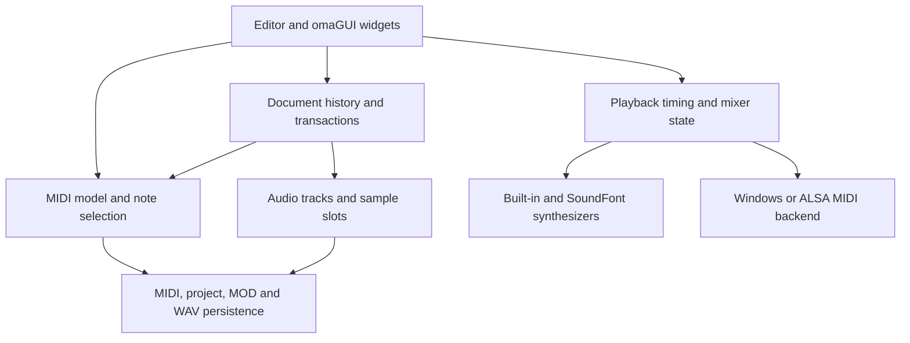

<!--
    Project: OpenSesh
    File: docs/ARCHITECTURE.md
    Purpose: Explain module boundaries, ownership, and platform integration.
    Responsibilities: document stable data and control flow.
    This file does not describe private reference-application internals.
-->

# Architecture

OpenSesh is a native FreeBASIC application. The GUI coordinates independent
model, persistence, playback, and platform modules. The application entry
point owns the widgets and shuts down input, samples, audio workers, and the
display before exit.

## Source boundaries

| Area | Main modules | Responsibility |
| --- | --- | --- |
| Application | `src/opensesh.bas` | Widget ownership, commands, presentation, startup and shutdown |
| MIDI data | `midi_model`, `note_selection`, `score_tools` | Bounded parsing, document editing and score operations |
| History | `document_history`, `history_timeline`, `project_transaction` | Chronological undo and transactional persistence |
| Audio data | `audio_tracks`, `audio_sample_slots` | Clip metadata, decoded audio ownership and sample-slot reconciliation |
| Playback | `playback_state`, `playback_timing`, `playback_mix`, `selected_note_playback` | Transport, automation timing and selected-note playback |
| Synthesis | `software_synth`, `soundfont_bank`, `soundfont_synth`, `sfx_runtime` | Voices, SF2 decoding, audio-worker lifetime and shared runtime shutdown |
| Platform MIDI | `midi_input_win`, `midi_output_sfx`, `midi_alsa`, `midi_null` | Native endpoints and explicit unavailable-endpoint behavior |
| Presentation | `ui_style`, `ui_icons`, `ui_interaction`, `touch_gesture`, `ui_frame_pacing` | Themes, control states, interaction modes and frame scheduling |
| Export | `music_export`, `wav_export_sfx` | MOD and PCM WAV output with bounded serialization |

Names without an extension refer to matching `.bas` and `.bi` files under
`src`. Public declarations belong in `.bi` files; implementations belong in
`.bas` files. Internal headers expose only the helpers their including module
needs. The unity entry point is used by targets whose packaging tool requires
a single source input; desktop builds compile separate modules.

## Ownership and failure boundaries

The MIDI model owns its input buffer, editable-note storage, and non-note
event sidecar. Callers edit through the model API. Parsing validates chunk
lengths and event bounds before reading or allocating. A failed operation must
preserve the current document or return a documented empty result.

Persistence modules use the shared atomic-file helper to stage a replacement
before committing it. Project transactions coordinate related MIDI and audio
files. Tests cover malformed inputs, occupied temporary paths, rollback, and
shorter replacements over longer files.

SoundFont rendering has an audio worker. Every linked module therefore uses
FreeBASIC's thread-safe runtime with `-mt`. Shutdown releases loaded sample
slots before stopping the shared audio runtime. UI callbacks must use the
existing synchronization boundaries when they change worker-visible state.

## Dependencies and platforms

`vendor/omaGui/SNAPSHOT.sha256` defines the exact redistributable GUI payload.
Local development copies can contain additional historical material, but
source archives and Git commits include only the release subset. Dependency
bytes retain their original line endings so a checkout reproduces the hashes.

Windows uses WinMM input and sfxlib output; Linux uses ALSA Sequencer. The
null MIDI backend reports unavailable external endpoints on other targets.
Building Android is separate from qualifying physical Android MIDI devices.
SoundFonts remain user supplied and are not bundled.

<!-- end of docs/ARCHITECTURE.md -->
